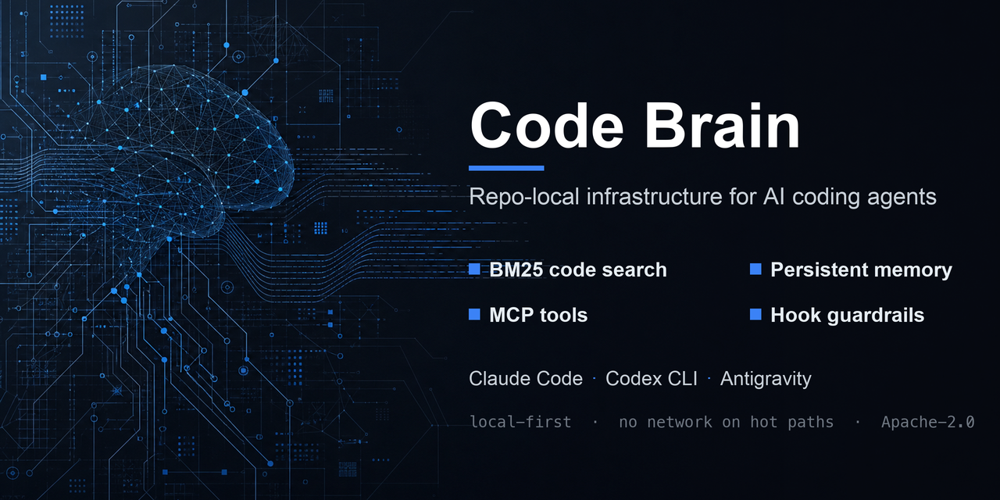

<p align="center"></p>

# Code Brain

[](https://github.com/ezBuilder/code-brain/releases)
[](https://github.com/ezBuilder/code-brain/blob/main/LICENSE)
[](https://github.com/ezBuilder/code-brain/actions/workflows/release-gate.yml)
[](https://github.com/ezBuilder/code-brain/stargazers)


[한국어](ko.md) · [English](../../README.md) · [中文](zh-CN.md) · [日本語](ja.md) · Español · [Français](fr.md) · [Deutsch](de.md)

Code Brain es infraestructura local del repositorio para agentes de codificación con IA serios. Proporciona a Claude Code, Codex CLI y Google Antigravity la misma memoria de proyecto, búsqueda de código BM25, política de hooks, herramientas MCP, registro de auditoría y ruta de actualización dentro de un mismo espacio de trabajo.

Está construido sobre una verdad incómoda: los agentes son potentes, pero olvidan el contexto, leen demasiado código, vuelcan salidas enormes y se desvían entre herramientas. Code Brain convierte un repositorio en una capa operativa lista para agentes.

## Por Qué Destaca

- **Un solo cerebro para múltiples agentes.** Claude, Codex y Antigravity comparten el mismo contrato `.ai/`, la memoria, el índice de búsqueda, los hooks y la superficie de comandos.
- **Consciente de los tokens por defecto.** MCP arranca en el perfil ligero `usage`: solo se exponen de entrada `obs_usage`, `code_query`, `context_pack`, `code_read_hashline` y `tool_search`.
- **Buscar antes de dispersarse.** Los agentes localizan el código con BM25/FTS5 y paquetes de contexto compactos en lugar de volcar archivos a ciegas en el prompt.
- **Ediciones seguras con hashline.** `code_read_hashline` proporciona anclas de línea+sha antes de editar, reduciendo parches obsoletos o mal ubicados.
- **Salvaguardas en la ruta crítica.** Los hooks bloquean git destructivo, volcados amplios de grep/find, fugas de secretos y salidas largas antes de que desperdicien tokens o expongan datos.
- **Memoria y artefactos acotados.** Los archivos JSONL/log/evidencia generados en tiempo de ejecución tienen límites y comprobaciones de doctor para que un repositorio no crezca de forma silenciosa.
- **Consolidación de memoria sin conexión.** El `ai memory page-in` en tiempo de reposo precalienta una caché HOT clasificada por relevancia para que la siguiente sesión cargue un contexto más ajustado y con menos tokens sin ninguna llamada de red.
- **Ruta de actualización desde repositorio público.** Los proyectos instalados pueden ejecutar `/cb-upgrade` o `.ai/bin/ai upgrade latest --json` para extraer desde GitHub y reinicializar.
- **Higiene de publicación pública.** La memoria/estado de origen no se propaga a los proyectos de destino; el escaneo de secretos, la cadena de auditoría, el manifiesto y las comprobaciones de artefactos generados están integrados.

## Instalación Rápida

```bash
# macOS / Linux
git clone https://github.com/ezBuilder/code-brain.git
cd code-brain
bash scripts/install.sh /path/to/project
```

En un shell interactivo, el instalador de macOS/Linux también ofrece por defecto el kit global de Claude/Codex. Los `~/.claude/CLAUDE.md` y `~/.codex/AGENTS.md` existentes se respaldan y conservan; Code Brain añade o actualiza solo su bloque gestionado. Las instalaciones de CI y no interactivas omiten las escrituras globales a menos que pases `--global`; usa `--no-global` para optar explícitamente por no hacerlo.

```powershell
# Windows PowerShell
git clone https://github.com/ezBuilder/code-brain.git
cd code-brain
powershell -NoProfile -ExecutionPolicy Bypass -File .\scripts\install.ps1 C:\path\to\project
```

El éxito termina con:

```text
[code-brain] installed. New AI sessions in <project> now load Code Brain memory, search, hooks, and MCP automatically.
```

Abre una nueva sesión de Claude/Codex/Antigravity después de la instalación.

## Actualizar Desde GitHub

Dentro de un proyecto instalado:

```bash
cd /path/to/project
.ai/bin/ai upgrade latest --json
```

Dentro de una sesión de agente, ejecuta:

```text
/cb-upgrade
```

Tras una actualización exitosa, abre una nueva sesión de agente para que se carguen los nuevos hooks, la configuración MCP, `AGENTS.md` y `CLAUDE.md`.

Para la inicialización por primera vez sin mantener un clon local:

```bash
curl -fsSL https://raw.githubusercontent.com/ezBuilder/code-brain/main/scripts/upgrade-from-github.sh | bash -s -- /path/to/project
```

Para la inicialización no interactiva con el kit global:

```bash
curl -fsSL https://raw.githubusercontent.com/ezBuilder/code-brain/main/scripts/upgrade-from-github.sh | bash -s -- --global /path/to/project
```

Fija una versión o rama:

```bash
.ai/bin/ai upgrade latest --ref v0.2.0 --json
CODE_BRAIN_REF=v0.2.0 bash scripts/upgrade-from-github.sh /path/to/project
```

Las actualizaciones son explícitas. Los hooks de `SessionStart` y las rutas críticas de MCP no llaman a la red.

## Flujo de Trabajo del Agente

Empieza acotado y luego edita con anclas:

```bash
cd /path/to/project
.ai/bin/ai code query "auth flow" --json
.ai/bin/ai context pack "auth flow" --json
.ai/bin/ai code read-hashline src/app.py --start 10 --end 80
.ai/bin/ai doctor --strict --json
.ai/bin/ai obs usage --json
.ai/bin/ai memory recall --query "auth flow" --json
.ai/bin/ai memory decision list --kind failure --json
.ai/bin/ai memory conflicts --json
.ai/bin/ai plan init --id feat --step "do A" --step "do B"
.ai/bin/ai memory decision add --text "use X" --contradicts dec-1234 --expires-at 2026-12-31
```

La recuperación abarca decisiones, fallos, lecciones y procedimientos en una sola respuesta clasificada y citada; `memory conflicts` detecta decisiones contradictorias sin conexión. Un plan duradero (`ai plan`) mantiene el trabajo multipaso hasta el final: con `AI_LOOP_CONTINUATION`, el hook Stop vuelve a indicar hasta que cada paso esté marcado. `code_find_references` / `code_goto_definition` añaden navegación de nivel LSP cuando hay un servidor de lenguaje instalado. Extras opcionales: las decisiones pueden llevar relaciones `contradicts`/`derives_from`/`expires_at` (las caducadas se excluyen del recall); `AI_MCP_RESOURCES` expone plans/reports/handoff como recursos MCP de solo lectura `codebrain://`; `AI_AST_CHUNK` cambia la indexación de Python a fragmentación consciente del AST (cAST).

Herramientas MCP por defecto:

```text
code_query              BM25/FTS5 code search
context_pack            compact agent-ready context
code_read_hashline      line+sha edit anchors
obs_usage               actual Claude/Codex usage and Code Brain overhead
tool_search             discover hidden MCP tool schemas
```

Comandos slash/source comunes:

```text
/cb-usage    token and Code Brain activity
/cb-search   code search
/cb-health   doctor + queue + index summary
/cb-doctor   strict diagnostics
/cb-exec     bounded sandbox output
/cb-upgrade  upgrade from the public repo
```

## Puntos de Prueba

No confíes en afirmaciones de benchmarks sintéticos. Code Brain incluye comprobaciones que puedes ejecutar en tu propio repositorio:

```bash
make lint
scripts/lockfile-check.sh
uv lock --check --project .ai/runtime
uv run --project .ai/runtime python -m pytest .ai/runtime/tests/test_cli.py -k "upgrade_latest or cb_upgrade_command_assets"
.ai/bin/ai upgrade latest --dry-run --json
.ai/bin/ai index rebuild --json
.ai/bin/ai doctor --strict --json
.ai/bin/ai obs usage --json
```

Lo que estas demuestran:

- existen activos de instalación y actualización para Claude, Codex y Antigravity
- la planificación de actualización desde repositorio público funciona sin tocar archivos en modo dry-run
- el doctor estricto verifica la configuración, la frescura del índice, el manifiesto, la cadena de auditoría, el escaneo de secretos, el SLO de la ruta crítica, los artefactos generados acotados y el registro de comandos
- el informe de uso lee los registros reales de Claude/Codex en lugar de estimar el ahorro de tokens

Para un README público, encabeza con estas comprobaciones reproducibles. Añade cifras de benchmark solo cuando las genere un script repetible en `scripts/` o CI.

## Qué Se Instala

```text
.ai/                         runtime, memory structure, hooks, MCP shim
.mcp.json                    Claude Code MCP
.codex/config.toml           Codex MCP profile usage
.codex/hooks.json            Codex hooks
.claude/settings.json        Claude Code hooks
.claude/commands/            slash commands
.codex/prompts/              Codex prompts
.agents/mcp_config.json      Antigravity MCP
.agents/hooks.json           Antigravity hooks
.agents/skills/              source-command skills
.githooks/post-merge         index refresh
.githooks/post-checkout      index refresh
AGENTS.md                    seed-only mirror of .ai/AGENTS.md
CLAUDE.md                    seed-only mirror of .ai/AGENTS.md
```

Instalación, actualización y desinstalación manuales:

```bash
bash scripts/install-into.sh install /path/to/project
bash scripts/install-into.sh upgrade /path/to/project
bash scripts/install-into.sh uninstall /path/to/project
```

El MCP global de Antigravity es opcional y solo por inclusión explícita:

```bash
AI_INSTALL_GLOBAL_ANTIGRAVITY=1 bash scripts/setup-antigravity-global.sh
```

El instalador de nivel superior de macOS/Linux puede instalar el kit global de Claude/Codex. Respalda los archivos existentes y fusiona solo el bloque gestionado de Code Brain en `~/.claude/CLAUDE.md` y `~/.codex/AGENTS.md`; los settings, hooks, comandos, agentes y skills de Claude se fusionan o copian bajo `~/.claude/`. La configuración global de Antigravity solo actualiza la entrada `code-brain` cuando se solicita explícitamente.

## Valores Predeterminados de Token y Disco

Perfil MCP por defecto:

```text
AI_CODE_BRAIN_PROFILE=usage
AI_MCP_COMPACT_TOOLS=1
```

Exposición de herramientas por perfil:

```text
usage: obs_usage, code_query, context_pack, code_read_hashline, tool_search
core:  usage + obs_health_summary, obs_search, doctor_strict
full:  all MCP tools
```

Límites de artefactos generados:

```text
.ai/memory/events/events.jsonl       4MB cap, payload 20KB cap
.ai/memory/prompt_growth.jsonl       512KB cap
.ai/memory/prompt_growth/versions/   keep latest 30
.ai/memory/evidence.jsonl            4MB cap
.ai/memory/session-current.md        100KB cap
.ai/cache/sandbox/                   pruned after Stop/SessionEnd
```

Limpieza manual:

```bash
.ai/bin/ai memory page-out --json
.ai/bin/ai exec prune --older-than-seconds 86400 --json
.ai/bin/ai audit rebuild-index --json
```

`doctor --strict` falla en `generated_artifacts_bounded` si los archivos acotados crecen más allá de los límites.

## Seguridad e Higiene del Repositorio Público

- No leas, imprimas, edites ni hagas commit de secretos reales.
- `.env`, claves, tokens, certificados, almacenes de contraseñas, estado de ejecución y memoria privada se mantienen fuera del repositorio de código público.
- Los instaladores no copian datos de origen `.ai/memory/*` ni `.ai/runtime/state/*` a los proyectos de destino.
- Las rutas críticas de hook/MCP son locales y no llaman a la red.
- `AI_INSTALL_GLOBAL_ANTIGRAVITY=1` es obligatorio antes de modificar cualquier archivo global de Antigravity.
- CI y los candidatos de versión deben superar `make lint`, las pruebas dirigidas, `make doctor`, las comprobaciones de lockfile y `make release-gate`.

## Mapa de Arquitectura

```text
.ai/
├── bin/                         ai / ai-hook / ai-mcp (+ PowerShell shims)
├── runtime/src/ai_core/
│   ├── search.py                BM25 FTS5 + chunking
│   ├── hashline.py              line+sha edit anchors
│   ├── hooks.py                 Claude/Codex/Antigravity hook handling
│   ├── mcp_server.py            MCP JSON-RPC stdio server
│   ├── mcp_config.py            Claude/Codex/Antigravity config dialects
│   ├── memory.py                decisions/todos/audit/events rotation
│   ├── memory_tier.py           page-out / page-in / tiering
│   ├── memory_hot.py            sleep-time salience-ranked HOT memory cache
│   ├── evidence.py              bounded evidence ledger
│   ├── doctor.py                release and safety checks
│   ├── obs.py                   usage/health/search diagnostics
│   ├── sandbox.py               bounded command output capture
│   └── security_findings.py     redacted security finding ledger
├── memory/                      per-project durable memory
├── cache/                       sqlite/sandbox/generated cache
├── generated/                   render/install manifests
└── AGENTS.md                    canonical local agent contract
```

## Licencia

Apache-2.0.
