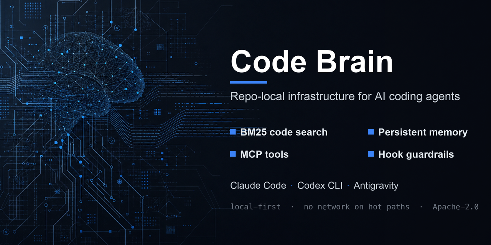

<p align="center"></p>

<h1 align="center">Code Brain</h1>

<p align="center"><b>AI 코딩 에이전트에 메모리, 검색, 가드레일, 업그레이드 경로를 제공하는 레포 로컬 인프라.</b></p>

<p align="center">
<a href="https://github.com/ezBuilder/code-brain/releases"></a>
<a href="https://github.com/ezBuilder/code-brain/blob/main/LICENSE"></a>
<a href="https://github.com/ezBuilder/code-brain/actions/workflows/release-gate.yml"></a>
</p>

<p align="center">


</p>

<p align="center">
한국어 · <a href="../../README.md">English</a> · <a href="zh-CN.md">中文</a> · <a href="ja.md">日本語</a> · <a href="es.md">Español</a> · <a href="fr.md">Français</a> · <a href="de.md">Deutsch</a>
</p>

---

에이전트는 강력하지만 잘 잊습니다. 같은 파일을 반복해 읽고, 4만 토큰짜리 grep 결과를 컨텍스트에 쏟아붓고, 낡은 라인 번호에 패치를 시도하고, 세션이 끝나면 모든 결정을 잃고, 할 일이 남았는데도 성공했다며 턴을 종료합니다. Code Brain은 레포지토리에 설치되어 이 실패들을 도구 경계에서 차단합니다. **Claude Code, Codex CLI, Google Antigravity, Kiro**가 동일한 `.ai/` 런타임, 메모리, 인덱스, 훅 정책, 감사 기록을 공유합니다.

한 번 설치하면 하나의 뇌를 레포의 모든 에이전트가 함께 씁니다.

## 핵심

| | |
|---|---|
| **하나의 뇌, 네 개의 호스트** | Claude, Codex, Antigravity, Kiro가 동일한 `.ai/` 계약, 메모리, 검색 인덱스, 가드된 훅 런타임을 공유합니다. MCP 노출만 호스트별로 다릅니다. |
| **난잡함보다 먼저 검색** | 파일을 프롬프트에 쏟아붓는 대신 BM25/FTS5와 제한된 컨텍스트 팩으로 코드를 찾습니다. |
| **해시라인 안전 편집** | `code_read_hashline`이 라인+sha 앵커를 제공해 패치가 의도한 위치에 정확히 적용됩니다. |
| **핫 패스 가드레일** | 훅이 파괴적 git, 광범위한 grep/find 덤프, 시크릿 유출, 폭주 출력을 토큰을 낭비하기 전에 차단합니다. |
| **끝까지 일하는 에이전트** | 완료 가드는 요청 범위의 기계적 미완료 증거가 남아 있는 동안 `Stop`을 거부하고, 증거가 낡으면 양보합니다. |
| **무손실 메모리, 제한된 인덱스** | 원본 감사 기록은 봉인된 64MB 세그먼트의 불변 진실이며, 모든 롤업·에피소딕 티어·로그에 상한과 doctor 체크가 있습니다. |
| **로그 스케일 회상** | 결정론적 fanout-10 에피소딕 피라미드가 상주 컨텍스트를 `O(log N)`으로 유지하고, `drill-down`은 항상 원본 행에 도달합니다. |
| **기본부터 토큰 의식** | MCP는 가벼운 `usage` 프로필로 시작하며, 나머지는 `tool_search`로 필요할 때 드러납니다. |
| **공개 레포 업그레이드** | 설치된 프로젝트는 `/cb-upgrade` 또는 `.ai/bin/ai upgrade latest --json`으로 GitHub에서 가져와 재부트스트랩합니다. |
| **계약에 의한 오프라인** | 훅과 MCP 핫 패스는 네트워크를 호출하지 않습니다. 모델 다운로드와 메모리 동기화는 명시적 명령입니다. |

## 빠른 시작

```bash
# macOS / Linux
git clone https://github.com/ezBuilder/code-brain.git
cd code-brain
bash scripts/install.sh /path/to/project
```

```powershell
# Windows PowerShell
git clone https://github.com/ezBuilder/code-brain.git
cd code-brain
powershell -NoProfile -ExecutionPolicy Bypass -File .\scripts\install.ps1 C:\path\to\project
```

성공 시 마지막 줄:

```text
[code-brain] installed. New AI sessions in <project> now load Code Brain memory, search, hooks, and MCP automatically.
```

설치 후 **새** 에이전트 세션을 열어야 훅, MCP 설정, `AGENTS.md`가 로드됩니다.

대화형 셸에서는 macOS/Linux 설치기가 Claude/Codex 전역 킷 설치도 함께 제안합니다. 기존 `~/.claude/CLAUDE.md`와 `~/.codex/AGENTS.md`는 백업·보존되고 Code Brain은 자신의 관리 블록만 추가·갱신합니다. CI와 비대화형 설치는 `--global`을 넘기지 않으면 전역 쓰기를 건너뛰며, `--no-global`로 명시적 거부가 가능합니다.

로컬 클론 없이 부트스트랩:

```bash
curl -fsSL https://raw.githubusercontent.com/ezBuilder/code-brain/main/scripts/upgrade-from-github.sh | bash -s -- /path/to/project
```

## 업그레이드

설치된 프로젝트 안에서:

```bash
.ai/bin/ai upgrade latest --json
.ai/bin/ai upgrade latest --dry-run --json
```

에이전트 세션에서는 `/cb-upgrade`를 실행하고 새 세션을 엽니다. 특정 ref 고정:

```bash
.ai/bin/ai upgrade latest --ref v0.9.1 --json
CODE_BRAIN_REF=v0.9.1 bash scripts/upgrade-from-github.sh /path/to/project
```

업그레이드는 항상 명시적입니다. `SessionStart` 훅과 MCP 핫 패스는 네트워크를 사용하지 않습니다.

## 에이전트 워크플로

좁게 시작하고, 앵커로 편집하고, 결과를 검증합니다.

```bash
.ai/bin/ai code query "auth flow" --json                       # 1. 찾기
.ai/bin/ai context pack "auth flow" --json                     # 2. 제한된 컨텍스트 + 구조
.ai/bin/ai code read-hashline src/app.py --start 10 --end 80    # 3. 편집 전 라인+sha 앵커
.ai/bin/ai doctor --strict --json                              # 4. 레포 건강 증명
.ai/bin/ai obs usage --json                                    # 실제 호스트 토큰 사용량 + CB 오버헤드
```

세션을 넘어 지속되는 메모리:

```bash
.ai/bin/ai memory recall --query "auth flow" --json
.ai/bin/ai memory decision add --text "use X" --contradicts dec-1234 --expires-at 2026-12-31
.ai/bin/ai memory conflicts --json
.ai/bin/ai memory forget --id dec-1234 --confirm-id dec-1234 --yes
.ai/bin/ai plan init --id feat --step "do A" --step "do B"
```

`memory recall`은 결정, 실패, 교훈, 절차를 하나의 순위화된 인용 답변으로 묶습니다. `ai plan`은 다단계 작업을 정직하게 유지하며, `AI_LOOP_CONTINUATION`이 켜지면 Stop 훅이 모든 단계가 체크될 때까지 재요청합니다. `ai memory forget`은 레코드를 완전 삭제(툼스톤 + 컴팩션 + 삭제 영수증)하여 `SessionStart` 주입을 포함한 어떤 읽기 경로에서도 되살아나지 않게 합니다.

심볼·호출 그래프 추출은 ast-grep을 통해 **Python, TypeScript, JavaScript, Rust, Go, Dart, Kotlin**을 지원합니다. 100KB 청크 상한을 넘는 파일도 조용히 건너뛰지 않고, 제한된 중첩 윈도와 상한이 걸린 심볼 스팬으로 스트리밍되며 모든 누락은 분류와 이유가 함께 보고됩니다.

## 메모리 모델

원본 궤적이 진실이고, 요약은 색인일 뿐입니다.

```text
원본 감사  ──► 봉인된 64MB 다이제스트 세그먼트 (불변, 해시 체인)
   │
   ├─ tier 0   1 이벤트       원문
   ├─ tier 1   10 이벤트      결정론적 요약  ─┐
   ├─ tier 2   100 이벤트     결정론적 요약   ├─ fanout 10, 상주 컨텍스트 O(log N)
   └─ tier 3+  1,000 …        결정론적 요약  ─┘
   │
   └─ 모든 요약이 원본 step ID 보존 ──► ai memory episodic drill-down
```

```bash
.ai/bin/ai memory episodic status --json
.ai/bin/ai memory episodic context --byte-budget 8000 --raw-tail 20 --json
.ai/bin/ai memory episodic drill-down --start 100 --end 120 --json
```

오래된 기억은 거칠고 최근 기억은 자세하며, 전체 색인 크기는 세션 생애에 대해 로그 비율로 증가합니다. 모든 티어는 잘못된 행, 해시 체인 변경, 원본으로 재현할 수 없는 요약에 대해 fail-closed로 동작합니다. `SessionStart`는 200바이트 상한의 `cb-life:` 캐시만 읽고, 중요한 판단은 원본 행으로 drill-down합니다. [에피소딕 메모리 문서](../EPISODIC_MEMORY.md)를 참고하세요.

원본 메모리는 기본적으로 비공개입니다. 설치·업그레이드는 프로젝트 메모리를 전파하지 않으며, 머신 간 동기화는 명시적 `--private-remote-confirmed`를 요구하고 모든 세그먼트를 원자적으로 스테이징하며 union merge를 비활성화하고 시퀀스 공백을 거부합니다. 동기화는 훅에서 실행되지 않습니다.

## 가드레일

**완료 가드**(기본 활성)는 요청 범위의 기계적 증거가 남아 있을 때만 `Stop`/`SubagentStop`을 거부합니다. 변경된 활성 플랜, 새 충돌·문법·미완료 마커, 이후 성공한 관련 검사가 없는 변경, 새로 실패한 인수 실행이 그 대상입니다. 검증은 호스트 도구 호출 ID, 종료 상태, 편집 순서, 현재 편집 대상 콘텐츠 해시에 묶이며, 낡거나 손상되거나 부분적인 증거는 양보합니다. dirty 트리나 오래된 백로그를 현재 작업으로 취급하지 않고, 보안·사용자 입력·컨텍스트 압박 정지를 덮어쓰지 않으며, 동일 증거 반복 또는 8회 연속/30분 상한에서 양보합니다.

**훅 정책**은 파괴적 git, 광범위한 `grep -r`/`find`/`tree` 덤프, 시크릿 포함 커밋, 과대 출력을 `PreToolUse`에서 차단하고 `sandbox_execute` / `ai exec run`으로 유도합니다.

**MCP 인자 계약**은 핸들러 실행 전 모든 호출을 검증합니다. 필수 문자열은 `tools/list`에 `minLength: 1`을 게시하고, 거부는 호출자 텍스트가 아닌 스키마 필드를 명시하며, 동일한 거부가 3회 연속되면 명시적 정지 지시로 격상됩니다.

## 호스트 지원

| 호스트 | 훅 | MCP 설정 | 명령 |
|---|---|---|---|
| Claude Code | 21 | `.mcp.json` | `.claude/commands/cb-*` |
| Codex CLI | 12 | `.codex/config.toml` (`usage` 프로필) | `.codex/prompts/cb-*` |
| Google Antigravity | 5개 중 3개 (`PreToolUse`, `PostInvocation` 미지원) | `.agents/mcp_config.json` | `.agents/skills/` |
| Kiro IDE / CLI v3 | 5 | — | `.agents/skills/` |

Kiro 전용 `.kiro/hooks/code-brain.json`은 IDE와 CLI v3에서 활성이며, CLI v2에서는 비활성 상태의 전방 호환 시드로 남습니다.

모든 호스트에서 쓸 수 있는 명령:

```text
/cb-usage    토큰 및 Code Brain 활동
/cb-search   코드 검색
/cb-health   doctor + 큐 + 인덱스 요약
/cb-doctor   strict 진단
/cb-exec     제한된 샌드박스 출력
/cb-upgrade  공개 레포에서 업그레이드
/cb-proof    legacy/v2 검색 A/B 및 내구성 증명
```

## MCP 표면

등록된 메서드 62개를 점진적으로 노출합니다.

```text
usage: obs_usage, code_query, context_pack, code_read_hashline, tool_search
core:  usage + obs_health_summary, obs_search, doctor_strict
full:     숨겨진 워커 풀 표면(loopd_*, loop_submit)을 제외한 전체
full-all: 워커 풀 포함 전체
```

선택적 파일럿 6개 중 4개가 기본 활성(`AI_MCP_RESOURCES`, `AI_DIR_CONTEXT`, `AI_MEMORY_CONFLICT_SCAN`, `AI_LOOP_CONTINUATION`)이고 `AI_AST_CHUNK`, `AI_SELF_IMPROVE_AUTO`는 비활성입니다. `ai config pilots`로 관리하며, cAST는 `ai cast eval` 회상 래칫이 기본 청커를 이길 때만 활성화됩니다. 측정 없이 바뀌는 것은 없습니다.

## 증명

합성 벤치마크 주장을 믿지 마십시오. 직접 실행해 보십시오.

```bash
make lint
make test
make eval
make doctor
.ai/bin/ai doctor --strict --json
.ai/bin/ai context prove --json
.ai/bin/ai obs usage --json
```

- **strict doctor 37개 체크**가 설정, 인덱스 신선도, 매니페스트, 감사 체인, 시크릿 스캔, 핫 패스 SLO, 산출물 상한, 저장 한도, 훅 능력, 명령 등록을 검증합니다.
- **강제 eval 축 7개**(`precall_routing`, `context_budget`, `tool_discovery`, `autoresearch_retrieval`, `code_retrieval`, `line_span_retrieval`, `memory_retrieval`)가 회상 성능 퇴행 시 빌드를 실패시킵니다. 만료·반박·툼스톤 처리된 레코드는 절대 상위에 오르지 못합니다.
- **`ai context prove` / `/cb-proof`**가 legacy 대비 v2 검색 A/B, 그래프 활성화, 결정론, 제한된 컨텍스트, 지연, 워밍업 이후 검색 파일 무증가를 측정합니다.
- **`obs usage`**는 실제 Claude/Codex 로그를 읽습니다. Code Brain은 추정 절감 토큰을 출력하지 않으며 `no_token_estimates`가 doctor 체크입니다.

## 설치되는 것

```text
.ai/                         런타임, 메모리 구조, 훅, MCP shim
.mcp.json                    Claude Code MCP
.claude/settings.json        Claude Code 훅
.codex/config.toml           Codex MCP usage 프로필
.codex/hooks.json            Codex 훅
.agents/mcp_config.json      Antigravity MCP
.agents/hooks.json           Antigravity 훅
.kiro/hooks/code-brain.json  Kiro IDE/CLI v3 훅 (CLI v2 시드)
.githooks/post-merge         인덱스 갱신
AGENTS.md                    표준 시드 + 관리되는 지속 메모리 블록
CLAUDE.md                    `.ai/AGENTS.md`의 시드 전용 미러
```

수동 라이프사이클:

```bash
bash scripts/install-into.sh install /path/to/project
bash scripts/install-into.sh upgrade /path/to/project
bash scripts/install-into.sh uninstall /path/to/project
```

두 진입점 모두 동일한 매니페스트 소유권, 심링크 봉쇄, 바이트 no-op, 비파괴 제거 계약을 공유합니다. 영속 write-ahead 저널이 명령 실패, 인터럽트, SIGKILL, 정전 재시도 후에도 관리 파일과 이전 `core.hooksPath`, 정상 venv를 복원합니다.

설치·업그레이드는 대상 트랜잭션 커밋 후 Code Brain이 관리하는 정확한 Codex 프로젝트 훅을 신뢰 처리하므로, 새로 설치해도 곧바로 사용할 수 있습니다. 외부/커스텀 훅과 전역 사용자 훅은 절대 자동 신뢰되지 않습니다. `AI_CODEX_HOOK_AUTO_TRUST=0`으로 검토 게이트를 유지할 수 있습니다.

## 토큰·디스크 기본값

```text
AI_CODE_BRAIN_PROFILE=usage      가벼운 MCP 표면
AI_MCP_COMPACT_TOOLS=1           압축된 도구 스키마
AI_PROMPT_GROWTH=0               프롬프트 성장 텔레메트리 off
AI_MEMORY_TIER_SUMMARY=0         티어 텔레메트리 off
AI_CODEGRAPH_SUMMARY=0           핫스팟 텔레메트리 off
AI_MEMORY_PAGE_IN=0              HOT 캐시 예열 off
AI_AUTO_PAGE_OUT=0               인라인 page-out off
```

비용이 큰 기능은 모두 opt-in입니다. 분리된 슬립 타임 page-out만 유지되어 무손실 감사 세그먼트 봉인, 비파괴 롤업 갱신, 에피소딕 피라미드 구축을 Stop 핫 패스 비용 없이 수행합니다.

주요 산출물 상한:

```text
.ai/memory/audit/YYYY.jsonl          64MB 근처에서 무손실 봉인; 원본 유지
.ai/memory/audit-rollups/            64MB 상한, 최상위 16개
.ai/memory/episodic/                 128MB 상한, 최상위 8개
.ai/memory/episodic-tombstones/      권위 있는 forget 마커; 회수 대상 아님
.ai/tmp/                             512MB 상한, 7일 보관, 256개
.ai/outputs/                         1GB 상한, 최상위 512개
.ai/                                 2GB 회수 가능 데이터 상한; 권위 메모리 제외
```

추적되는 최상위 항목, `.keep`을 포함한 디렉터리, `<name>.keep` 형제 항목은 보존되며 강제 상한에서 제외됩니다. 고정된 바이트가 상한을 충족 불가능하게 만들지 않습니다. 권위 있는 감사·결정·세션 메모리와 forget 툼스톤은 별도로 보고되고 자동 삭제되지 않습니다.

## 보안

- 실제 시크릿을 읽거나 출력하거나 커밋하지 않습니다. `.env`, 키, 토큰, 인증서, 런타임 상태, 비공개 메모리는 공개 소스 레포 밖에 있습니다.
- 설치기는 소스의 `.ai/memory/*` 또는 `.ai/runtime/state/*`를 대상 프로젝트로 복사하지 않습니다.
- 훅·MCP 핫 패스는 로컬이며 네트워크를 호출하지 않습니다.
- 감사 체인 검증은 중복 ID/시퀀스, 다이제스트·링크·바이트 수 조작, 비결정적 동기화 분기를 거부합니다.
- MCP·진단·외부 채널 출력은 편집(redaction)되며 `redaction_self_test`가 doctor 체크입니다.
- CI는 읽기 전용입니다. 쓰기 명령은 워커에 도달하기 전에 종료 코드 16으로 거부됩니다.

## 문서

| 문서 | 내용 |
|---|---|
| [ARCHITECTURE.md](../../ARCHITECTURE.md) | 컴포넌트 맵과 설계 계약 |
| [OPERATIONS.md](../../OPERATIONS.md) | 운영 런북, 진단, CI 정책, 훅 신뢰 |
| [EPISODIC_MEMORY.md](../EPISODIC_MEMORY.md) | 에피소딕 피라미드와 무손실 감사 기록 |
| [SECURITY.md](../../SECURITY.md) | 신고 및 보안 경계 |
| [CHANGELOG.md](../../CHANGELOG.md) | 버전 이력 |

## 라이선스

Apache-2.0.
